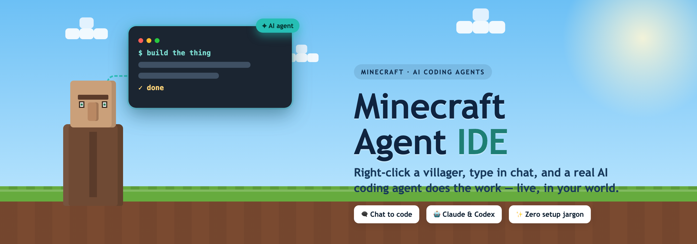

<p align="center">
  
</p>

<h1 align="center">Minecraft Agent IDE</h1>

<p align="center">
  <b>Chat with a villager in Minecraft — and a real AI coding assistant does the work.</b><br>
  Right-click a villager, type what you want, and watch it build, edit, and answer in real time.
</p>

<p align="center">
  
  
  
  
</p>

---

## 🧩 What is this?

Imagine walking up to a character in Minecraft, telling it *“add a login page to my website,”* and it **actually does it** — on your real computer — while its progress floats above its head.

That’s this project.

**Minecraft Agent IDE** turns an ordinary Minecraft villager into a friendly face for a powerful **AI coding assistant** (like Anthropic’s **Claude Code** or OpenAI’s **Codex**). You chat with the villager in normal Minecraft chat; the AI reads and writes real files in a project folder on your computer and reports back — right there in the game.

No command line. No code editor. Just a villager and a chat box.

## ✨ What you can do

- 🗨️ **Ask in plain English** — *“fix the bug in my app,” “explain this file,” “add dark mode.”*
- 👀 **Watch it work** — a little panel above the villager shows what it’s doing: reading files, running commands, its to‑do plan.
- ✅ **Stay in control** — when the AI wants to run something, you get clickable **[Allow]** / **[Reject]** buttons in chat.
- 🤖 **Bring your own AI** — Claude Code, Codex, or any assistant that speaks the open *Agent Client Protocol*.
- 🧑‍🤝‍🧑 **Many helpers at once** — spawn several villagers, each on its own task.

## 🎬 How it works

There are two small programs. You don’t need to understand them — just know there are two:

1. **The Minecraft plugin** — lives on your Minecraft server. It only knows about villagers and chat.
2. **The linker** — a small app on the computer where your project lives. It’s the bridge that runs the AI and lets it touch your files.

```
   You  ➜  🧑 Villager (Minecraft)  ➜  🔗 Linker (your computer)  ➜  🤖 AI agent  ➜  📁 your project
                           ⬅  replies, live progress, questions  ⬅
```

Your code never touches the Minecraft server — everything happens safely on **your own computer**.

## 🚀 Get started

First grab a few free things: **Java 21**, a **Paper Minecraft server (1.21+)**, **Node.js**, and an account for your AI (a **Claude** or **OpenAI** login). Then:

### 1. Download
From the **[latest release](../../releases/latest)**, download the two files:
- `MinecraftAgentIDE-<version>.jar` — the Minecraft plugin
- `minecraft-agent-linker-<version>.jar` — the linker

*(Prefer to build it yourself? See [For developers](#️-for-developers).)*

### 2. Start the linker (on your computer)
```bash
java -jar minecraft-agent-linker-<version>.jar
```
The first run creates a `linker.json` file next to it. Open it and set **one** thing:
`defaultCwd` — the folder you want the AI to work in.

### 3. Add the plugin (to your server)
Drop `MinecraftAgentIDE-<version>.jar` into your server’s `plugins/` folder and restart it.

### 4. Play 🎉
- Join the server and type `/agent spawn`.
- A villager appears — type in chat to talk to it.
- Ask it to do something. That’s it!

## 🕹️ In‑game commands

| Command | What it does |
| --- | --- |
| `/agent spawn [ai]` | Spawn a helper villager and start chatting |
| `/agent talk` | Talk to the nearest villager |
| `/agent stop` | Stop / cancel the current task |
| `/agent list` | List your helper villagers |
| `/agent remove` | Remove the nearest villager |
| `/agent status` | Check the connection to the linker |
| `/agent debug` | Fix‑it tools: move, rebuild, reconnect, or clean up stuck villagers |

💡 You can also just **right‑click** a villager to start talking.

## ❓ FAQ

**Do I need to know how to code?**
No — to *use* it, you just chat. The AI does the coding.

**Is my code uploaded to the Minecraft server?**
No. The AI runs on your own computer; the server only ever sees chat messages.

**Which AIs work?**
Claude Code and Codex out of the box — plus any *ACP* agent with a small config tweak.

**Does it cost money?**
This project is free and open‑source. Your AI account (Claude / OpenAI) has its own pricing.

## 🛠️ For developers

<details>
<summary><b>Build from source, architecture, and internals</b></summary>

<br>

### Build
```bash
./gradlew build
```
Outputs:
- Plugin: `mc-plugin/build/libs/MinecraftAgentIDE-<version>.jar`
- Linker: `linker/build/libs/minecraft-agent-linker-<version>.jar`

> The plugin compiles against `paper-api` from the PaperMC Maven repo (`https://repo.papermc.io`), so that host must be reachable when you build `mc-plugin`.

### Modules
| Module | What it is |
| --- | --- |
| `acp-core` | A dependency‑light Java implementation of the **Agent Client Protocol (ACP)**: a bidirectional JSON‑RPC/NDJSON peer plus a typed `AgentConnection` (`initialize`, `session/new`, `session/load`, `session/prompt`, `session/update`, `session/request_permission`, `fs/*`). |
| `bridge-protocol` | The JSON message contract between the plugin and the linker (`BridgeMessage`, `BridgeCodec`). |
| `linker` | Desktop app: WebSocket bridge server + `SessionManager` that launches one ACP agent per villager, maps ACP ⇄ bridge, and persists sessions so they can be resumed. |
| `mc-plugin` | The Paper plugin: villager NPCs, chat capture, floating status panels, clickable permission buttons, `/agent` command. |

### How the pieces talk
```
 ┌────────────────────┐      WebSocket        ┌───────────────────────┐   JSON-RPC / stdio   ┌──────────────────┐
 │  Minecraft (Paper) │ ─ bridge protocol ─▶  │   Desktop Linker      │ ─── ACP (NDJSON) ──▶ │   ACP Agent      │
 │  villager NPCs     │ ◀─ (plugin ⇄ linker)  │  (ACP client + bridge)│ ◀─────────────────── │  Claude Code /   │
 │  mc-plugin         │                       │   linker              │                      │  Codex / …       │
 └────────────────────┘                       └───────────────────────┘                      └──────────────────┘
```

### Configure the linker
On first run the linker writes `linker.json` and listens on `127.0.0.1:8765`. Agent commands and the default workspace are auto‑resolved from your installation; the main thing to set is `defaultCwd`. Any ACP agent works — add a profile with the right `command` (e.g. `["npx","-y","@zed-industries/claude-code-acp"]`, `gemini --experimental-acp`, a local `codex-acp` binary, …).

The plugin reads `plugins/MinecraftAgentIDE/config.yml` — point `linker.host`/`linker.port` at the linker (and set a shared `token` if the linker uses one).

### Requirements
- **Java 21** (Paper 1.21 and the linker both need it).
- A **Paper** server, 1.21+.
- **Node.js** on the linker machine (the default agents run via `npx`).
- Credentials for whichever agent you use (an Anthropic or OpenAI login / API key in the linker’s environment).

### Test the AI end‑to‑end without Minecraft
The linker jar ships a terminal REPL that stands in for the plugin:
```bash
java -cp minecraft-agent-linker-<version>.jar \
     dev.ghast.linker.tools.ConsoleClient ws://127.0.0.1:8765 claude-code
```
Type a message to prompt the agent; output, tool calls, plans and permission prompts print inline (`/cancel`, `/allow`, `/deny`, `/quit`). Set `ACP_TRACE=1` to log the raw ACP traffic.

Fast unit tests for the protocol layers:
```bash
./gradlew test
```

### References
- Agent Client Protocol — https://agentclientprotocol.com
- ACP spec — https://github.com/agentclientprotocol/agent-client-protocol
- Claude Code ACP adapter — https://www.npmjs.com/package/@zed-industries/claude-code-acp
- Codex ACP adapter — https://github.com/zed-industries/codex-acp
- Paper API — https://docs.papermc.io/paper/dev

</details>

---

<p align="center"><sub>Built for fun. Your world, your code, your AI.</sub></p>
